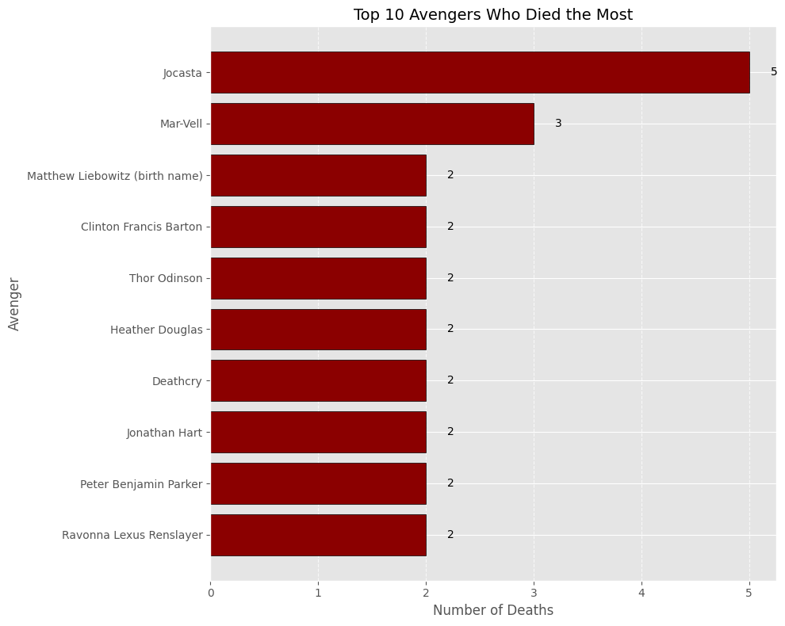

# Avengers Data Analysis

## Table of Contents
1. [Introduction](#introduction)
2. [Questions](#questions)
3. [Data Description](#data-description)
4. [Dataset Dictionary](#dataset-dictionary)
5. [Analysis](#analysis)
   - [Question 1: How many Avengers have died at least once?](#question-1-how-many-avengers-have-died-at-least-once)
   - [Question 2: Top 10 Avengers Who Died the Most](#question-2-top-10-avengers-who-died-the-most)
   - [Question 3: Did all characters die at some point?](#question-3-did-all-characters-die-at-some-point)
   - [Question 4: What is the distribution of deaths among Avengers?](#question-4-what-is-the-distribution-of-deaths-among-avengers)
   - [Question 5: How many times did the Avengers return from death?](#question-5-how-many-times-did-the-avengers-return-from-death)
   - [Question 6: Is there a difference in mortality between characters of different genders?](#question-6-is-there-a-difference-in-mortality-between-characters-of-different-genders)
   - [Question 7: Has mortality changed over the years?](#question-7-has-mortality-changed-over-the-years)
   - [Question 8: Are there Avengers who died multiple times and returned?](#question-8-are-there-avengers-who-died-multiple-times-and-returned)
   - [Question 9: Which characters are currently active or inactive?](#question-9-which-characters-are-currently-active-or-inactive)
   - [Question 10: Who are the top 10 characters with the most appearances who never died?](#question-10-who-are-the-top-10-characters-with-the-most-appearances-who-never-died)
   - [Question 11: What is the average time (in years) since a character joined the Avengers?](#question-11-what-is-the-average-time-in-years-since-a-character-joined-the-avengers)
6. [Conclusion](#conclusion)

## Introduction
This project analyzes data on Avengers characters, exploring their deaths, returns, and other statistics.

## Questions
1. How many Avengers have died at least once?
2. Top 10 Avengers Who Died the Most 
3. What is the distribution of deaths among characters?
4. Did all characters die at some point?
5. Is there a difference in mortality between characters of different genders?
6. What is the relationship between the number of appearances and deaths?
7. Has mortality changed over the years?
8. Are there Avengers who died multiple times and returned?
9. Which characters are currently active or inactive?
10. Who are the characters with the most appearances who never died?
11. What is the average time since a character joined the Avengers?

## Data Description
- The dataset includes various attributes such as name, appearances, deaths, returns, and gender of the Avengers.

### Dataset Dictionary

Header | Definition
---|---------
`URL`| The URL of the comic character on the Marvel Wikia
`Name/Alias` | The full name or alias of the character
`Appearances` | The number of comic books that character appeared in as of April 30 
`Current?` | Is the member currently active on an avengers affiliated team?
`Gender` | The recorded gender of the character
`Probationary` | Sometimes the character was given probationary status as an Avenger, this is the date that happened
`Full/Reserve` | The month and year the character was introduced as a full or reserve member of the Avengers
`Year` | The year the character was introduced as a full or reserve member of the Avengers
`Years since joining` | 2015 minus the year
`Honorary` | The status of the avenger, if they were given "Honorary" Avenger status, if they are simply in the "Academy," or "Full" otherwise
`Death1` | Yes if the Avenger died, No if not. 
`Return1` | Yes if the Avenger returned from their first death, No if  they did not, blank if not applicable
`Death2` | Yes if the Avenger died a second time after their revival, No if they did not, blank if not applicable
`Return2` | Yes if the Avenger returned from their second death, No if they did not, blank if not applicable
`Death3` | Yes if the Avenger died a third time after their second revival, No if they did not, blank if not applicable
`Return3` | Yes if the Avenger returned from their third death, No if they did not, blank if not applicable
`Death4` | Yes if the Avenger died a fourth time after their third revival, No if they did not, blank if not applicable
`Return4` | Yes if the Avenger returned from their fourth death, No if they did not, blank if not applicable
`Death5` | Yes if the Avenger died a fifth time after their fourth revival, No if they did not, blank if not applicable
`Return5` | Yes if the Avenger returned from their fifth death, No if they did not, blank if not applicable
`Notes` | Descriptions of deaths and resurrections. 

## Analysis

### Question 1: How many Avengers have died at least once?
**Result:** 69 Avengers died at least one time!

### Question 2: Top 10 Avengers Who Died the Most

### Question 3: Did all characters die at some point? 
**Result:** Not all characters have died
**Number of characters who have not died:** 104

**Characters Who Never Died:**

| **Character Name** | **Character Name** |
|-------------------------------|-------------------------------|
| Richard Milhouse Jones         | Marc Spector                  |
| Heracles                       | John F. Walker                |
| T'Challa                       | Miguel Santos                 |
| Dane Whitman                   | Julia Carpenter               |
| Henry P. McCoy                 | Christopher Powell            |
| Yondu Udonta                   | Reed Richards                 |
| Martinex T'Naga                | Susan Richards (née Storm)    |
| Charlie-27                     | Ashley Crawford               |
| Nicholette Gold                | Val Ventura                   |
| Stakar                         | Craig Hollis                  |
| Vance Astrovik                 | Gene Lorrene                  |
| Carol Susan Jane Danvers       | Dorreen Green                 |
| Samuel Thomas Wilson           | Tippy-Toe                     |
| Greer Grant Nelson             | Greg Willis                   |
| Monica Rambeau                 | Circe                        |
| Eros                           | Walter Newell                 |
| James R. Rhodes                | Elvin Haliday                 |
| Bonita Juarez                  | Crystal Amaquelin Maximoff    |
| Melissa Darrow                 | Phillip Javert                |
| Angelica Jones                 | Jessica Miriam Drew           |
| Delroy Garrett Jr.             | Jessica Jones                 |
| Maria de Guadalupe Santiago    | Amadeus Cho                   |
| Kelsey Leigh Shorr             | Maria Hill                    |
| Carl Lucas                     | Robbie Baldwin                |
| Nathaniel Richards             | Brunnhilde                    |
| Elijah Bradley                 | Brian Braddock                |
| William "Billy" Kaplan         | Noh-Varr                      |
| Theodore "Teddy" Altman         | John Aman                     |
| Katherine "Kate" Bishop        | Shang-Chi                     |
| Thomas "Tommy" Shepherd        | James Santini                 |
| Doctor Stephen Vincent Strange | Emery Schaub                  |
| James Buchanan Barnes          | Jeanne Foucault               |
| Jennifer Takeda                | Fiona                         |
| Yvette                         | Julie Power                   |
| Alani Ryan                     | Johnny Gallo                  |
| Lyra                           | Anya Corazon                  |
| Brandon Sharpe                 | Kevin Masterson               |
| Michiko Musashi                | Taki Matsuya                  |
| Daisy Johnson                  | Ororo Munroe                  |
| Matt Murdock                   | Flash Thompson                |
| Alex Summers                   | Samuel Guthrie                |
| Roberto da Costa               | Eden Fesi                     |
| Captain Universe               | Izzy Kane                     |
| Anna Marie                     | Sam Alexander                 |
| America Chavez                 | Loki Laufeyson                |
| David Alleyne                  | Nicholas Fury, Jr., Marcus Johnson |
| Phillip Coulson                | Tony Masters                  |
| Monica Chang                   | Doombot (Avenger)             |
| Alexis                         | Eric Brooks                   |
| Adam Brashear                  | Victor Alvarez                |
| Ava Ayala                      | Kaluu                         |

### Question 4: What is the distribution of deaths among avengers?

### Question 5: How many times did the Avengers return from death?
     - 0 returns: 127 characters
     - 1 return: 38 characters
     - 2 returns: 7 characters
     - 5 returns: 1 character
     

### Question 6: Is there a difference in mortality between characters of different genders?
**Gender**
- Female: 67
- Male: 127

### Question 7: Has mortality changed over the years?

### Question 8: Are there Avengers who died multiple times and returned?
**Result:** 

  - Thor Odinson
  - Clinton Francis Barton
  - Heather Douglas
  - Matthew Liebowitz
  - Mar-Vell
  - Jocasta
  - Anthony Ludgate Druid
  - Marrina Smallwood
  - Ravonna Lexus Renslayer
  - Dennis Dunphy
  - Peter Benjamin Parker
  - Eric Kevin Masterson
  - Deathcry
  - Jonathan Hart
  - Maya Lopez
  - Ares

### Question 9: Which characters are currently active or inactive?
**Number of active avengers:** 82
**Number of inactive avengers:** 91 

### Active Characters

| **Character Name**            | **Character Name**            |
|-------------------------------|-------------------------------|
| Henry Jonathan "Hank" Pym      | Jocasta                       |
| Janet van Dyne                 | Greer Grant Nelson            |
| Anthony Edward "Tony" Stark    | Jennifer Walters              |
| Robert Bruce Banner            | Monica Rambeau                |
| Thor Odinson                   | Reed Richards                 |
| Richard Milhouse Jones         | Ashley Crawford               |
| Steven Rogers                  | DeMarr Davis                  |
| Clinton Francis Barton         | Val Ventura                   |
| Pietro Maximoff                | Craig Hollis                  |
| Wanda Maximoff                 | Peter Benjamin Parker         |
| Heracles                       | Carl Lucas                    |
| Victor Shade (alias)           | James "Logan" Howlett         |
| Natalia Alianovna Romanova     | William "Billy" Kaplan        |
| Simon Williams                 | Dorrek VIII/Theodore "Teddy" Altman |
| Carol Susan Jane Danvers       | Katherine "Kate" Bishop       |
| Samuel Thomas Wilson           | Thomas "Tommy" Shepherd       |
| Jessica Miriam Drew            | Jessica Jones                 |
| Maria Hill                     | Noh-Varr                      |
| John Aman                      | Shang-Chi                     |
| James Santini                  | Emery Schaub                  |
| Jeanne Foucault                | Fiona                         |
| Jennifer Takeda                | Yvette                        |
| Julie Power                    | Alani Ryan                    |
| Humberto Lopez                 | Johnny Gallo                  |
| Lyra                           | Anya Corazon                  |
| Brandon Sharpe                 | Kevin Masterson               |
| Michiko Musashi                | Taki Matsuya                  |
| Flash Thompson                 | Alex Summers                  |
| Samuel Guthrie                 | Roberto da Costa              |
| Eden Fesi                      | Captain Universe              |
| Izzy Kane                      | Marcus Milton                 |
| Anna Marie                     | Shiro Yoshida                 |
| Ex Nihilo                      | Abyss (Ex Nihilo's)           |
| Adam                           | Kevin Kale Connor             |
| Sam Alexander                  | America Chavez                |
| David Alleyne                  | Nicholas Fury, Jr. (Marcus Johnson) |
| Phillip Coulson                | Victor Mancha                 |
| Monica Chang                   | Doombot (Avenger)             |
| Alexis                         | Eric Brooks                   |
| Adam Brashear                  | Victor Alvarez                |
| Ava Ayala                      | Kaluu                         |

### Inactive Characters

| **Character Name**            | **Character Name**            |
|-------------------------------|-------------------------------|
| Jacques Duquesne               | T'Challa                      |
| Dane Whitman                   | Brandt                        |
| Henry P. McCoy                 | Heather Douglas               |
| Patsy Walker                   | Matthew Liebowitz (birth name)|
| Robert L. Frank Sr.            | Yondu Udonta                  |
| Martinex T'Naga                | Charlie-27                    |
| Nicholette Gold                | Stakar                        |
| Vance Astrovik                 | Mar-Vell                      |
| Eros                           | James R. Rhodes               |
| Barbara Barton (née Morse)      | Moira Brandon                 |
| Benjamin Jacob Grimm           | Bonita Juarez                 |
| Marc Spector                   | John F. Walker                |
| Jim Hammond (alias)            | Miguel Santos                 |
| Julia Carpenter                | X-51                          |
| Christopher Powell             | Namor McKenzie                |
| Scott Edward Harris Lang       | Anthony Ludgate Druid         |
| Marrina Smallwood              | Ravonna Lexus Renslayer       |
| Rita DeMara                    | Dennis Dunphy                 |
| Gilgamesh                      | Susan Richards (née Storm)    |
| Wendell Elvis Vaughn           | Dinah Soar                    |
| Gene Lorrene                   | Dorreen Green                 |
| Monkey Joe                    | Doug Taggert                  |
| Tippy-Toe                      | Wade Wilson                   |
| Greg Willis                    | Circe                         |
| Walter Newell                  | Elvin Haliday                 |
| William Baker                  | Crystal Amaquelin Maximoff    |
| Eric Kevin Masterson           | Phillip Javert                |
| Melissa Darrow                 | Deathcry                      |
| Anthony Edward Stark           | Giulietta Nefaria             |
| Angelica Jones                 | Delroy Garrett Jr.            |
| Maria de Guadalupe Santiago    | Jonathan Hart                 |
| Kelsey Leigh Shorr             | Veranke                       |
| Robert Reynolds                | Maya Lopez                    |
| Nathaniel Richards             | Elijah Bradley                |
| Cassie Lang                    | Alias: Jonas                  |
| Daniel Thomas Rand K'ai        | Doctor Stephen Vincent Strange|
| Ares                           | James Buchanan Barnes         |
| Amadeus Cho                    | Robbie Baldwin                |
| Sharon Carter                  | Eric O'Grady                  |
| Brunnhilde                     | Richard Rider                 |
| Brian Braddock                 | Dennis Sykes                  |
| Thaddeus Ross                  | Ken Mack                      |
| Daisy Johnson                  | Ororo Munroe                  |
| Matt Murdock                   | Otto Octavius                 |
| Loki Laufeyson                 | Tony Masters                  |

### Question 10: Who are the top 10 characters with the most appearances who never died?
**Result:**

| Name                                | Appearances |
|-------------------------------------|-------------|
| Reed Richards                       | 2125        |
| Henry P. McCoy                     | 1886        |
| Susan Richards (nee Storm)         | 1761        |
| Ororo Munroe                       | 1598        |
| Matt Murdock                       | 1375        |
| Doctor Stephen Vincent Strange      | 1324        |
| Carol Susan Jane Danvers           | 935         |
| Carl Lucas                         | 886         |
| Anna Marie                         | 877         |
| T'Challa                           | 780         |

### Question 11: What is the average time (in years) since a character joined the Avengers?
**Result:** The average time (in years) since a character joined the Avengers is 26.55 years!

## Conclusion
We've uncovered some interesting (and sometimes alarming) insights about our favorite heroes. Turns out, being an Avenger might not be the best career move if you're looking for job security—unless you're into the whole "dying and coming back to life" thing. From mortality rates that rival the most dramatic soap operas to the ever-shifting roster of who's active or inactive, it's clear that being a superhero comes with its challenges.

So, if you're thinking about joining Earth's Mightiest Heroes, maybe think twice. After all, the data doesn’t lie—staying alive is no small feat in this lineup!

